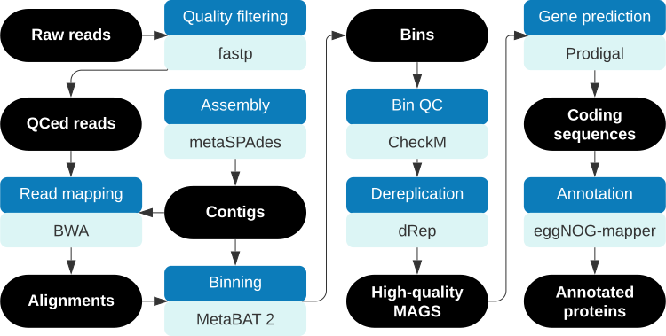

# WATL metagenomes analysis
MAG assembly pipeline and analysis code for 2022 Western Australia Transient Lakes (WATL) field effort.

## MAG assembly pipeline:


| Software      | Version | Purpose                        |
|---------------|---------|--------------------------------|
| fastp         | 0.23.4  | Trim and QC raw reads          |
| metaSPAdes    | 3.15.5  | Assemble contigs               |
| BWA           | 0.7.17  | Align QCed reads to contigs    |
| samtools      | 1.12    | Convert and sort alignments    |
| MetaBAT       | 2.17.23 | Bin contigs                    |
| GTDB-Tk       | 2.3.2   | Classify bins                  |
| CheckM        | 1.2.2   | QC bins                        |
| dRep          | 3.5.0   | Dereplicate bins               |
| Prodigal      | 2.6.3   | Predict protein-coding genes   |
| eggNOG-mapper | 2.1.12  | Annotate proteins              |
| Biopython     | 1.83    | Calculate protein stats        |

### Example usage:
```
./wrap_parallel.sh -n worklist.names -b bwa.maplist |& tee wrapper.log
```
